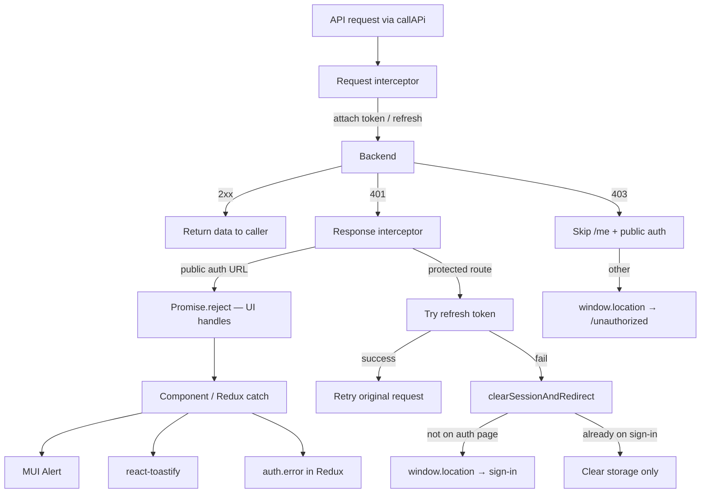

# Error Handling Audit

Audit date: **2026-05-25**

This document maps how errors are handled across the MIS Dashboard SaaS app, what is working well, and where gaps remain. Use it as a checklist when adding features or hardening existing flows.

---

## Executive summary

| Area | Status |
|------|--------|
| Global HTTP layer (Axios) | **Good** — token refresh, guarded redirects, public-auth URL detection |
| Auth Redux thunks | **Good** — all use `rejectWithValue` + `getApiErrorMessage` |
| Auth UI (sign-in, register) | **Good** — inline MUI `Alert` from Redux `error` state |
| Feature views (lists, forms) | **Mixed** — most use local `setError` + `Alert`; ~30 files duplicate manual parsing |
| Toast notifications | **Partial** — ~17 files; no global config; mixed with socket toasts |
| Silent failures | **Gaps** — several dashboards/log-only catches with no user feedback |
| Standardization | **Gap** — `getApiErrorMessage` only used in `authSlice` today |

---

## Architecture overview



---

## 1. Global layer

### 1.1 Axios interceptors — `src/redux/services/http-common.tsx`

| Behavior | Details |
|----------|---------|
| **Request** | Attaches Bearer token; proactively refreshes when near expiry |
| **401 (session)** | Retries once after refresh; on failure clears session |
| **401 (login/register)** | Public auth URLs are excluded from 403 redirect; session clear skips reload when already on an auth route (`/sign-in`, `/register`, etc.) |
| **403** | Redirects to `/unauthorized` except for `/me` endpoints and public auth URLs (prevents init redirect loops) |
| **Propagation** | Always `Promise.reject(error)` so callers can handle locally |

**Public auth URLs** (401/403 must not hard-redirect):

- `/api/auth/login`, `/api/auth/forgot-password`, `/api/auth/verify-otp`, `/api/auth/reset-password`
- `/api/customers/login`, `/api/customers/register`, `/api/customers/google-login`
- `/api/v1/bankAdmin/banks/login`, `/api/v1/superadmin-login`
- `/api/borrowers/login`, `/api/borrowers/register`, etc.
- `/api/banks/{slug}/login`, `/forgot-password`, `/verify-otp`, `/reset-password`

**Known gap:** Interceptor comment says *"show error toast"* on 401 but no toast is implemented — only `devWarn` in development.

**Recommendation:** Add early `isPublicAuthRequest` return on 401 before token refresh (avoids unnecessary refresh attempt on bad login credentials).

### 1.2 Error utility — `src/utils/api-error.ts`

```typescript
getApiErrorMessage(error, fallback?)
```

Handles:

- Plain strings (RTK `.unwrap()` reject payloads)
- `response.data.message`
- `response.data.error`
- `response.data.errors[]` (string or `{ message | msg }`)
- Axios `error.message` (skips generic `"Network Error"` fallback)

**Current usage:** `src/redux/slice/authSlice.tsx` only (10 call sites).

### 1.3 Route error boundary — `src/routes/components/error-boundary.tsx`

- Wired as React Router `errorElement` in `src/main.tsx`
- Shows status, stack trace, file path — developer-oriented
- Does not wrap the full app tree as a React class boundary

### 1.4 Toast setup — `src/main.tsx`

- **react-toastify:** `<ToastContainer />` with default options (no position/autoClose theme config)
- **Socket toasts:** `NotificationProvider` → `NotificationContainer` for push notifications only

Two parallel notification systems — use react-toastify for user actions; socket container for real-time alerts.

### 1.5 Redux error state — `src/redux/slice/authSlice.tsx`

- Only Redux slice in the app (`store.tsx` → `auth` only)
- `error: string | null` set on rejected auth thunks
- Actions: `setError`, `clearError` — **`clearError` is not called from views today** (stale errors can persist)
- `initializeAuth` / `fetchMe` failures intentionally fall back to unauthenticated without UI error

### 1.6 Unused hook — `src/hooks/use-api.ts`

Generic `execute` / `error` / `loading` wrapper. Parses errors as `err.message` only (weaker than `getApiErrorMessage`). **Zero usages** in the codebase.

---

## 2. Auth flows

| Flow | File | Error shown via | Status |
|------|------|-----------------|--------|
| Unified sign-in | `src/sections/auth/sign-in-view.tsx` | Redux `error` → `Alert` | ✅ Good |
| Admin sign-in | `src/sections/auth/sign-in-admin-view.tsx` | Redux `Alert` + `toast.error` | ⚠️ Duplicate; toast may show wrong text (`.unwrap()` throws string) |
| Super Admin sign-in | `src/sections/auth/sign-in-superadmin-view.tsx` | Redux `Alert` | ✅ Good (catch logs only) |
| Customer sign-in | `src/sections/auth/sign-in-customer-view.tsx` | Redux `Alert` | ✅ Good (catch logs only) |
| Register | `src/sections/auth/register-view.tsx` | Redux `Alert` | ✅ Good |
| Forgot password | `src/sections/auth/forgot-password-view.tsx` | Formik `status.submitError` → `Alert` | ⚠️ Uses `err?.message` only |
| Forgot password (admin) | `src/sections/auth/forgot-password-admin-view.tsx` | Formik `Alert` | ⚠️ Same |
| Verify OTP | `src/sections/auth/verify-otp-view.tsx` | Formik `Alert` | ⚠️ Resend has no catch |
| Verify OTP (admin) | `src/sections/auth/verify-otp-admin.tsx` | Formik `Alert` + toast on resend | ⚠️ Submit uses `err?.message` only |
| Reset password | `src/sections/auth/reset-password-view.tsx` | `toast.error` / `toast.success` only | ⚠️ No inline Alert |
| Google login | `src/components/auth/google-login-button.tsx` | `console.error` + optional `onError` | ❌ No default user UI |
| Logout | `src/layouts/components/account-popover.tsx` | None | ✅ Acceptable (local clear regardless) |
| Auth init | `src/components/auth/auth-initializer.tsx` | Loading spinner | ✅ Silent fallback intentional |

---

## 3. Patterns used in the codebase

| Pattern | Approx. scope | When to use |
|---------|---------------|-------------|
| `getApiErrorMessage(error, fallback)` | 1 file (auth slice) | **Preferred** for all API error parsing |
| `rejectWithValue(...)` | Auth thunks only | Redux async actions |
| `useState` + `setError` + `Alert severity="error"` | ~35 views | Page-level fetch/load failures |
| `toast.error` / `toast.success` | ~17 files | Transient mutation feedback |
| Manual `err?.response?.data?.message \|\| err?.message` | ~35 files | Legacy — migrate to utility |
| Formik `status.submitError` + `Alert` | Auth forms, bank/borrower forms | Form submit errors |
| `console.error` only | ~15 files | **Should add user-facing UI** |
| Empty / silent `catch` | ~10 sites | **Should surface or log meaningfully** |

### Recommended standard

1. **Parse** all API errors with `getApiErrorMessage(error, fallback)`.
2. **Page/load failures** → dismissible MUI `Alert` (+ optional Retry button).
3. **Mutations** → `toast.success` / `toast.error` **or** Alert, not both for the same error.
4. **Auth Redux errors** → show `useAuth().error`; call `clearError()` on mount or new submit.
5. **RTK `.unwrap()` catch** → pass caught value to `getApiErrorMessage` (payload may be a plain string).
6. **Session expiry** → consider a brief toast before redirect, or React Router navigate instead of `window.location`.

---

## 4. Module inventory

### 4.1 Well handled (Alert + setError or Redux)

| Module | Key files |
|--------|-----------|
| Bank admin — borrowers | `borrower-view.tsx`, `borrower-detail-view.tsx`, `borrower-form-view.tsx` |
| Bank admin — loans | `loan-application-view.tsx`, `loan-application-detail-view.tsx` |
| Bank admin — payments | `payment-view.tsx` |
| Bank admin — recovery | `recovery-view.tsx` |
| Bank admin — reports | `report-view.tsx` |
| Bank admin — employees | `employee-view.tsx`, `employee-form-view.tsx` |
| Bank admin — credit | `credit-rating-view.tsx`, `credit-proposal-report-*-view.tsx` |
| Bank admin — assessment | `assessment-view.tsx`, `settings-view.tsx` |
| Superadmin — banks | `bank-view.tsx`, `bank-payments-view.tsx`, `bank-form-view.tsx` |
| Superadmin — subscription | `subscription-required-view.tsx` |
| Employee — recovery | `my-cases-view.tsx`, `recovery-stats-view.tsx` |
| Customer — pay installment | `pay-installment-view.tsx` (Alert + retry + toast) |
| Customer — documents, assessment, credit, payoff | respective `*-view.tsx` files |
| Users | `users-view.tsx`, `users-form-view.tsx` |
| Profile | `profile-me-view.tsx` |

### 4.2 Gaps — no or weak user-facing error

| Priority | File | Issue |
|----------|------|-------|
| **P0** | `src/sections/customer/dashboard/customer-dashboard-view.tsx` | `console.error` only on fetch failure |
| **P0** | `src/sections/customer/apply-loan/apply-loan-view.tsx` | `console.error` only |
| **P0** | `src/sections/portfolio/portfolio-overview-view.tsx` | Multiple silent `catch` blocks on stats/graphs |
| **P0** | `src/pages/super-admin/bank-details.tsx` | Silent fetch → generic "Bank not found" |
| **P0** | `src/components/auth/google-login-button.tsx` | No default error UI |
| **P0** | `src/sections/auth/verify-otp-view.tsx` | OTP resend not caught |
| **P0** | `src/layouts/components/notifications-popover.tsx` | Fetch/mark failures silent |
| **P1** | `src/sections/auth/forgot-password-view.tsx` | `err?.message` only |
| **P1** | `src/sections/auth/forgot-password-admin-view.tsx` | Same |
| **P1** | `src/sections/auth/verify-otp-admin.tsx` | Submit/resend inconsistent |
| **P1** | `src/sections/auth/reset-password-view.tsx` | Toast-only; manual parsing |
| **P1** | `src/sections/auth/sign-in-admin-view.tsx` | Duplicate Alert + toast |
| **P1** | `src/sections/customer/apply-loan/apply-loan-form-view.tsx` | Prefetch failures swallowed |
| **P1** | `src/sections/Bankadmin/credit-proposal-report/view/credit-proposal-report-detail-view.tsx` | `err.message` only |
| **P1** | `src/pages/admin/borrower-edit.tsx` | Typography error, not Alert |
| **P1** | `src/pages/admin/users-edit.tsx` | Same |
| **P1** | `src/pages/admin/users-detail.tsx` | Same |
| **P2** | `src/sections/Bankadmin/borrower/borrower-form-view.tsx` | Alert + toast duplicate |
| **P2** | `src/hooks/use-api.ts` | Weak parsing; unused |
| **P2** | `src/main.tsx` | Configure `ToastContainer` defaults |
| **P2** | `src/routes/components/error-boundary.tsx` | Add user-friendly recovery (Go home / Retry) |

---

## 5. Hard redirects on errors

| Location | Trigger | Intentional? |
|----------|---------|--------------|
| `http-common.tsx` → `clearSessionAndRedirect` | Refresh fails / session expired | ✅ Yes — skips reload if already on auth route |
| `http-common.tsx` → `/unauthorized` | 403 on protected endpoints | ✅ Yes — skips `/me` and public auth |
| `protected-route.tsx` | Not authenticated | ✅ Yes — React Router `<Navigate>` |
| `auth-route-guard.tsx` | Already authenticated | ✅ Yes — React Router navigate |
| `settings-view.tsx` | Manual reload button | ✅ User-initiated, not error-driven |

No other `window.location` usage for error handling was found.

---

## 6. Recent fixes (login reload)

**Problem:** Failed login returned 401 → interceptor attempted token refresh → `clearSessionAndRedirect()` → full page reload → error state lost.

**Fixes applied in `http-common.tsx`:**

1. `isPublicAuthRequest()` — identifies login/register/password endpoints
2. `isAuthRoute()` — prevents `window.location` redirect when user is already on sign-in/register pages
3. 403 redirect skips public auth URLs (same as `/me` skip)

**Result:** Wrong credentials show inline `Alert` on sign-in without page reload.

---

## 7. Action plan (recommended order)

### Phase A — Quick wins

- [ ] Import `getApiErrorMessage` in all auth views that use `err?.message` (forgot password, OTP, reset password)
- [ ] Remove duplicate `toast.error` from `sign-in-admin-view.tsx` (Redux Alert is enough)
- [ ] Call `clearError()` on auth form mount/submit
- [ ] Add `onError` + Alert to `google-login-button.tsx` (or pass from parent)
- [ ] Add catch + Alert to OTP resend in `verify-otp-view.tsx`

### Phase B — Silent failure fixes

- [ ] `customer-dashboard-view.tsx` — add `error` state + Alert
- [ ] `apply-loan-view.tsx` — add `error` state + Alert
- [ ] `portfolio-overview-view.tsx` — surface per-widget errors or a single page Alert
- [ ] `bank-details.tsx` — show API error message instead of generic not-found
- [ ] `notifications-popover.tsx` — toast or inline error on fetch failure

### Phase C — Standardization

- [ ] Replace manual `response?.data?.message` parsing across ~35 files with `getApiErrorMessage`
- [ ] Configure `ToastContainer` in `main.tsx` (top-right, autoClose 4000, theme)
- [ ] Update `use-api.ts` to use `getApiErrorMessage` or remove if unused
- [ ] Add early 401 return for `isPublicAuthRequest` in interceptor (skip refresh on login failure)
- [ ] Improve `error-boundary.tsx` with "Go to dashboard" / "Try again" actions

### Phase D — Optional enhancements

- [ ] Session-expired toast before redirect
- [ ] Replace `window.location` redirects with React Router where feasible
- [ ] Add Vitest tests for `getApiErrorMessage` edge cases

---

## 8. File reference — error pattern by area

```
src/
├── redux/
│   ├── services/http-common.tsx     ← Global 401/403 handling
│   └── slice/authSlice.tsx          ← getApiErrorMessage + rejectWithValue
├── utils/api-error.ts               ← Shared error parser (adopt widely)
├── hooks/use-api.ts                 ← Unused; weak parsing
├── main.tsx                         ← ToastContainer
├── routes/components/error-boundary.tsx
├── components/auth/
│   ├── google-login-button.tsx      ← ❌ No default error UI
│   ├── auth-initializer.tsx
│   ├── protected-route.tsx
│   └── auth-route-guard.tsx
├── sections/auth/                   ← Sign-in, register, OTP, password
├── sections/Bankadmin/              ← Mostly ✅ Alert + setError
├── sections/customer/               ← Mixed (pay-installment ✅, dashboard ❌)
├── sections/Superadmin/             ← Mostly ✅; bank-details ❌
├── sections/Employee/               ← ✅
├── sections/portfolio/              ← ❌ Silent catches
├── sections/users/                  ← ✅
└── pages/admin/                     ← ⚠️ Typography instead of Alert
```

---

## 9. Testing checklist

When verifying error handling on a feature:

1. **Invalid credentials** — inline error, no page reload
2. **Network offline** — user sees meaningful message (not blank screen)
3. **403 wrong role** — redirect to `/unauthorized` or inline denial
4. **Session expired mid-session** — redirect to sign-in (with optional toast)
5. **Form validation** — field errors before API call
6. **API validation errors** — server `message` / field `errors[]` displayed
7. **Success path** — loading state clears; success toast or redirect

---

*Maintained as part of the MIS Dashboard codebase audit. Update this file when error-handling conventions change.*
